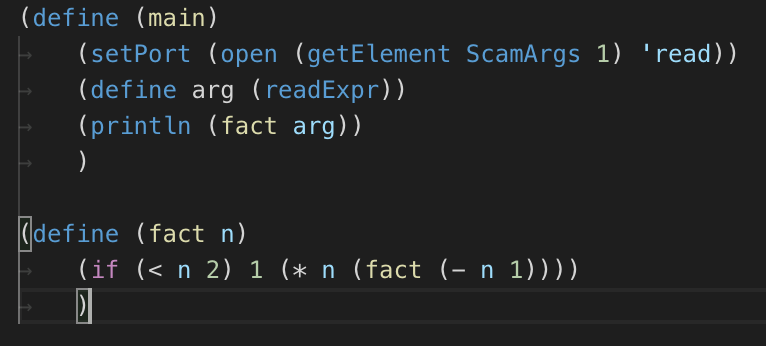

# Scam Syntax Highlighting

Basic syntax highlighting for the [scam](http://beastie.cs.ua.edu/scam/) programming language,
developed by Dr. John C. Lusth.

## Features

Basic syntax highlighting.

## Requirements

None

## Extension Settings

In order to change the theming of the syntax highlighting, change the following values in your theme:

- Booleans:
	- constant.language.boolean.true.scm
	- constant.language.boolean.false.scm
	- constant.language.boolean.null.scm
- Comments:
	- comment.block.scm
	- comment.line.scm
- Language Constants:
	- constant.language.scm (scamArgs)
- Functions:
	- storage.type.function.scm (for the opening `define` for functions)
	- entity.name.function.scm (for the actual function name)
	- keyword.other.lambda.scm (for the `lambda` definition)
- Keywords:
	- keyword.other.scm (for all non-control [if, else, etc.] keywords)
	- keyword.control.scm (for all control [if, else, etc.] keywords)
- Numbers
	- constant.numeric.scm
- Operators
	- keyword.operator.arithmetic.scm (+, -, *, /, %, ^)
	- storage.type (for operators dealing with converting types such as int and real)
- Enclosing Parenthesis
	- punctuation.paren.opens.scm
	- punctuation.paren.close.scm
- Strings
	- string.quoted.double.scm
	- constant.character.escape.scm (for escaped characters such as \n)
- Symbols (accessors)
	- support.type.property-name
- Variables
	- storage.type.variable.scm (for the opening `define` for variables)
	- variable.name.scm (for the actual variable name)

## Known Issues

- Function names will only be recognized when placed immediately beside a `(`.
- Unmatched operators placed right next to each other will show up as separate operators.

## Release Notes

Change log for this extension:

### 0.0.4

- Added support for exponential functions (`sqrt`, `expt`)
- Updated example screenshot

### 0.0.3

- Updated README
- Added support for more built-in operators (`=`, `^`, `abs`, `eval`, `readExpr`)
- Added support for storage types (int, real)
- Changed variable defines to use `storage.type.variable.scm`

### 0.0.2

- Fix the `string+` operator
- Add support for `lambda`
- Fixed README
- Added repository link

### 0.0.1

Initial release of scam-highlight
